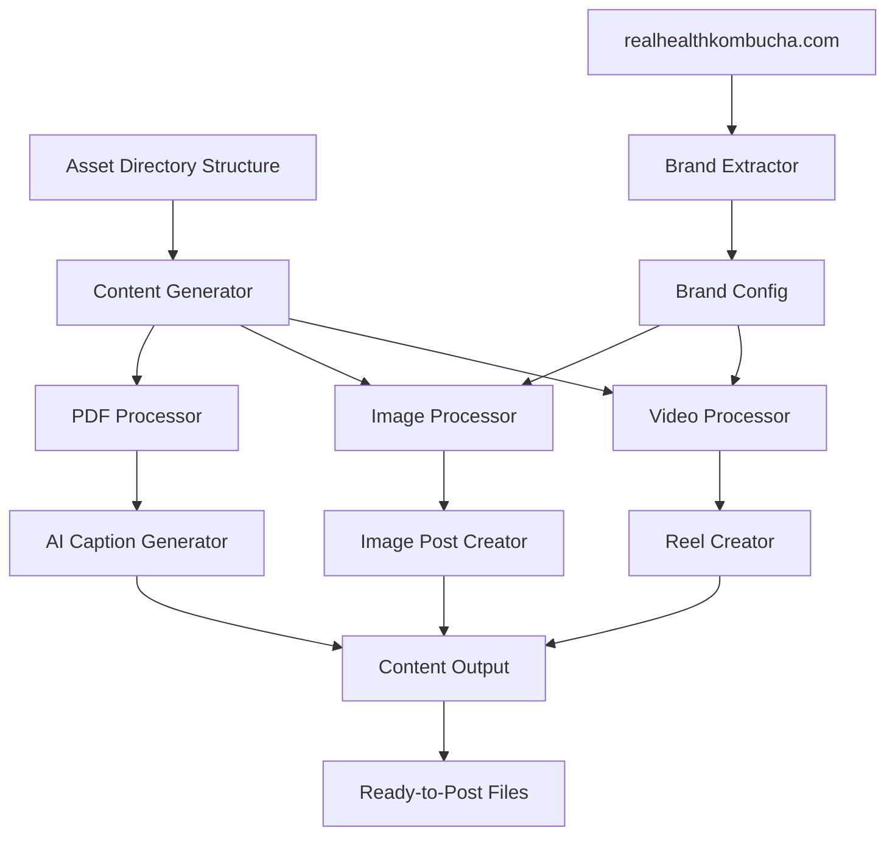

# Instagram Content Generation Engine

## Overview

A Python-based content generation system that automatically creates Instagram Reels and Feed posts from organized local assets. The system will process photos, videos, and PDFs organized by themes, generate AI-powered captions, and produce ready-to-post content files.

## Architecture



## Directory Structure

```
Kombucha/
├── assets/
│   ├── kombucha_benefits/
│   │   ├── images/
│   │   ├── videos/
│   │   └── pdfs/
│   ├── kombucha_research/
│   │   ├── images/
│   │   ├── videos/
│   │   └── pdfs/
│   └── [other_themes]/
├── output/
│   ├── reels/
│   └── feed_posts/
├── config/
│   └── settings.yaml
├── src/
│   ├── content_generator.py
│   ├── pdf_processor.py
│   ├── image_processor.py
│   ├── video_processor.py
│   ├── ai_caption_generator.py
│   ├── brand_extractor.py
│   └── utils.py
├── requirements.txt
└── main.py
```

## Key Components

### 1. Asset Organization (`src/content_generator.py`)

- Scan theme directories for available assets
- Select random or sequential assets based on topic
- Coordinate between PDFs, images, and videos for content creation

### 2. PDF Processing (`src/pdf_processor.py`)

- Extract text from PDFs using `pdfplumber` or `PyPDF2`
- Parse research papers and benefit documents
- Extract key points for caption generation

### 3. AI Caption Generation (`src/ai_caption_generator.py`)

- Use OpenAI API or local LLM (e.g., Ollama) to generate:
                                                                                                                                                                                                                                                                - Engaging captions based on PDF content
                                                                                                                                                                                                                                                                - Relevant hashtags for Madeira/local audience
                                                                                                                                                                                                                                                                - Call-to-action text for restaurants and health-conscious users
- Support multiple languages (Portuguese/English)

### 4. Image Processing (`src/image_processor.py`)

- Use `Pillow` (PIL) for:
                                                                                                                                                                                                                                                                - Adding text overlays with brand colors
                                                                                                                                                                                                                                                                - Applying filters and templates
                                                                                                                                                                                                                                                                - Creating quote cards from PDF content
                                                                                                                                                                                                                                                                - Resizing for Instagram dimensions (1080x1080 for feed, 1080x1920 for stories)

### 5. Video/Reel Processing (`src/video_processor.py`)

- Use `moviepy` for:
                                                                                                                                                                                                                                                                - Combining multiple video clips
                                                                                                                                                                                                                                                                - Adding background music
                                                                                                                                                                                                                                                                - Inserting text overlays and transitions
                                                                                                                                                                                                                                                                - Creating Reels format (1080x1920, 15-90 seconds)
                                                                                                                                                                                                                                                                - Adding captions/subtitles

### 6. Branding Extraction (`src/brand_extractor.py`)

- Extract brand identity from [realhealthkombucha.com](https://www.realhealthkombucha.com/):
                                                                                                                                - Parse CSS to extract color palette (primary, secondary, accent colors)
                                                                                                                                - Identify font families and typography used
                                                                                                                                - Extract logo/branding elements
                                                                                                                                - Save to configuration file for consistent use across all generated content

### 7. Content Output

- Generate organized output files:
                                                                                                                                - Final images/videos ready for posting
                                                                                                                                - Caption text files (`.txt`) with hashtags
                                                                                                                                - Metadata JSON files with posting suggestions

## Technology Stack

- **Python 3.9+**
- **Image Processing**: Pillow, OpenCV
- **Video Processing**: moviepy, ffmpeg
- **PDF Processing**: pdfplumber
- **AI/LLM**: OpenAI API (or Ollama for local)
- **Web Scraping**: BeautifulSoup4, requests (for brand extraction)
- **Configuration**: PyYAML
- **Utilities**: python-dotenv

## Implementation Steps

1. **Setup project structure** - Create directories and base files
2. **Brand extractor** - Extract colors, fonts, and branding from realhealthkombucha.com
3. **Configuration system** - YAML config with extracted brand values, themes, API keys
4. **PDF processor** - Extract and parse PDF content
5. **AI caption generator** - Integrate LLM for caption/hashtag generation
6. **Image processor** - Create feed posts with overlays using brand colors/fonts
7. **Video processor** - Create Reels with editing using brand styling
8. **Content generator** - Main orchestration logic
9. **CLI interface** - Command-line tool to generate content

## Configuration Example

The brand configuration will be automatically extracted from [realhealthkombucha.com](https://www.realhealthkombucha.com/) and saved to `config/settings.yaml`:

```yaml
brand:
  name: "Real Health Kombucha"
  website: "https://www.realhealthkombucha.com/"
  colors:
    # Extracted from website CSS
    primary: "#[extracted_from_website]"
    secondary: "#[extracted_from_website]"
    accent: "#[extracted_from_website]"
    text: "#[extracted_from_website]"
    background: "#[extracted_from_website]"
  fonts:
    # Extracted from website typography
    heading: "[extracted_font_family]"
    body: "[extracted_font_family]"
    weights:
      heading: "[bold/normal/etc]"
      body: "[normal/regular/etc]"

themes:
  - name: "kombucha_benefits"
    target_audience: ["health_conscious", "restaurants"]
    hashtags:
      base: ["#kombucha", "#madeira", "#healthy", "#realhealthkombucha"]
      custom: ["#kombuchamadeira", "#saude", "#madeiraisland"]
  - name: "kombucha_research"
    target_audience: ["health_conscious", "restaurants"]
    hashtags:
      base: ["#kombucha", "#madeira", "#research", "#realhealthkombucha"]
      custom: ["#kombucharesearch", "#saude", "#ciencia"]
  
ai:
  provider: "openai"  # or "ollama"
  model: "gpt-4"
  language: "pt"  # Portuguese for Madeira audience
```

## Usage Flow

1. User organizes assets in theme directories
2. Run: `python main.py --theme kombucha_benefits --type reel`
3. System selects assets, generates caption, creates video
4. Output saved to `output/reels/` with caption file
5. User manually posts to Instagram

## Future Enhancements

- Scheduling system for content calendar
- Instagram API integration (optional)
- Analytics tracking
- A/B testing for captions
- Multi-language support